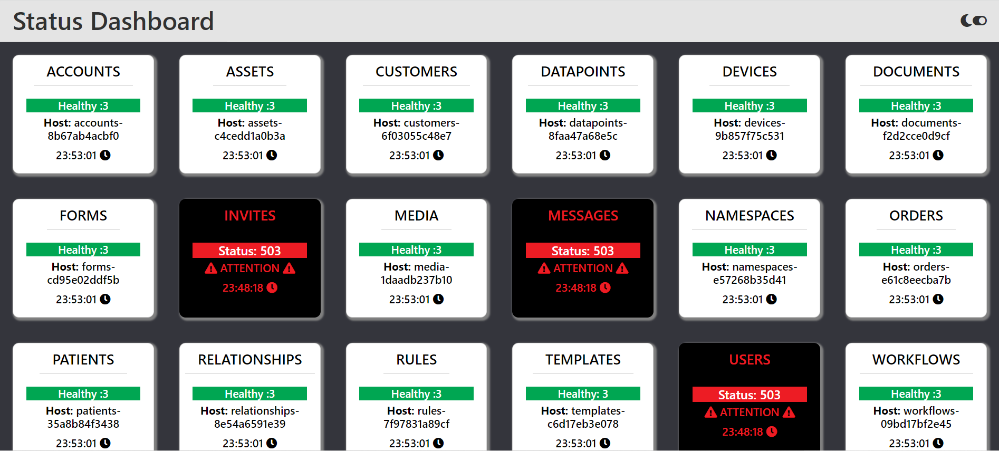

# <div align="center">📋 FactoryFour APIs Health Status Check</div>

<a href="https://factoryfour-api-status.netlify.app/">

                             </a>

## FactoryFour APIs Health Status Check

The project `FactoryFour APIs Health Status Check` is an single-page web application written using React with Typescript that allows user to check the conectivity status to the factoryFour APIs.

It is a Front End Coding Challenge for Inclusion Cloud React Developer Position.

## Getting Started

The following is recommended for the development environment:

1. Usage of [Visual Studio Code](https://code.visualstudio.com/) as IDE and the following plugins:

   - Prettier - Code formatter
   - ESLint

2. [Node.js](https://nodejs.org/en/download/)
3. [NPM](https://www.npmjs.com/)
4. [GIT](https://git-scm.com/)

## 🛠️ Technologies

<ul>
  <li><a href="https://reactjs.org/">React JS</a></li>
  <li><a href="https://nodejs.org/en/">Node.Js</a></li>
  <li><a href="https://www.typescriptlang.org/">Typescript</a></li>
  <li><a href="https://redux.js.org/">Redux</a></li>
  <li><a href="https://sass-lang.com/">Sass</a></li>
  
</ul>

### Folder Structure

`./dashboard/`  
├── `.gitignore` -> _ignore settings from git_  
├── `public` -> static and public files  
├── `src` -> react code
└── `templates` -> generate-react-cli template files  
└── `README.md` -> _content of this file_

`./dashboard/src/`  
├── `components` ->reusable React components, separated into subfolders  
└── `data` -> list containing API_NAME data  
└── `helpers` -> reusable functions  
├── `models` -> folder to organize TypeScript types from the project  
├── `pages` -> React pages, separated into subfolders  
├── `routes` -> routes configuration  
├── `scss` -> global style files  
├── `services` -> services for external access  
├── `store` -> redux settings and files

## 🎯 Notes

```
$ In order to easily change the range interval for displaying the most recent result from each API calls, you need to change "refreshTime" variable value located in the config.ts file which is placed in the project´s src directory.
```

## Run

```
$ git clone https://github.com/macamvv/admin-dashboard
$ cd admindashboard
$ npm install
$ npm start

The application will open in the browser on http://localhost:3000

```
